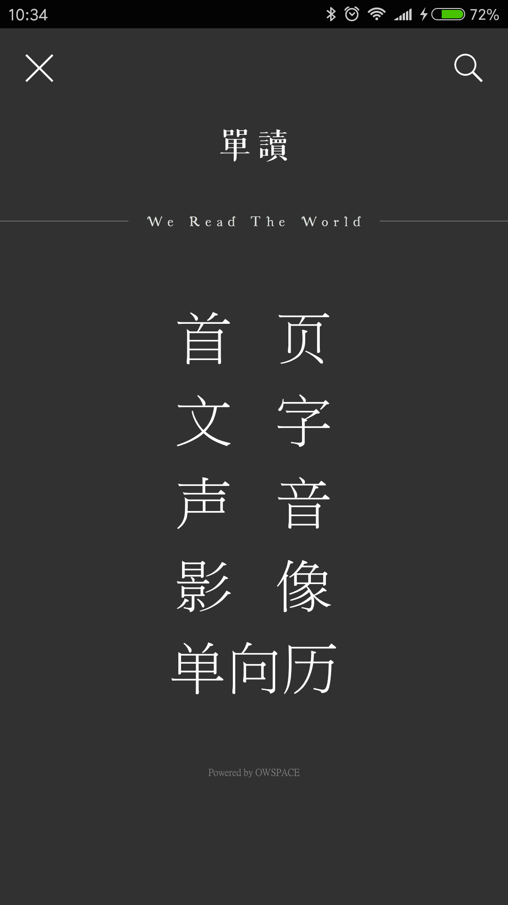
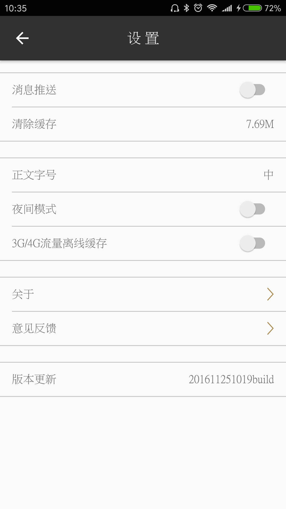

# owspace
owspace是基于MVP+Dagger2+Retrofit2.0+Rxjava的APP

# 简介
owspace是一款高仿单读的APP，API接口通过非法手段获取。<br>

# 你能学到
* MVP模式
* Retrofit2.0 + rxjava
* Dagger2
* jsoup解析DOM
* sqldelight SqlBrite
* 音视频播放等
* some fucking source code

# 里程碑列表
### 2018/3/27 升级API Level到27，各种依赖包全部升级
### 2017/11/27 更新gradle、更新相关dependencies版本
### 2016/11/25 添加音频播放
### 2016/11/8 添加视频播放功能
### 2016/11/4 添加新细明字体
### 2016/10/28 Dagger2改造
### 2016/7/21 初始化

# demo

[最新DEMO点击下载](https://beta.bugly.qq.com/5rik)


# 展示
 

 

 

 


# TODO LIST
* sqldelight SqlBrite 缓存
* 字体
* 评论列表
* some fucking features

# 声明
单读这个文艺的APP本人比较喜欢，一时冲动就抓取了数据，反编译了APP。so,API接口是通过非法手段获取，严禁商用，违者后果自负。<br>

# thanks
```
    implementation fileTree(include: ['*.jar'], dir: 'libs')
    implementation 'com.android.support:appcompat-v7:27.1.0'
    implementation 'com.android.support:recyclerview-v7:27.1.0'
    implementation 'com.android.support:design:27.1.0'
    implementation 'com.android.support.constraint:constraint-layout:1.0.2'
    testImplementation 'junit:junit:4.12'
    implementation(name: 'SildeMenulibrary-release', ext: 'aar')
    implementation(name: 'ObservableScrollView-release', ext: 'aar')
    implementation 'com.jakewharton:butterknife:8.8.1'
    annotationProcessor 'com.jakewharton:butterknife-compiler:8.8.1'
    implementation 'com.google.code.gson:gson:2.8.0'
    implementation 'net.danlew:android.joda:2.9.3'
    implementation 'com.squareup.okhttp3:okhttp:3.9.1'
    implementation 'com.squareup.okhttp3:logging-interceptor:3.9.1'
    implementation 'com.squareup.retrofit2:retrofit:2.3.0'
    implementation 'com.squareup.retrofit2:adapter-rxjava:2.1.0'
    implementation 'com.squareup.retrofit2:converter-gson:2.1.0'
    implementation 'com.squareup.sqlbrite:sqlbrite:0.7.0'
    implementation 'io.reactivex:rxandroid:1.2.1'
    implementation 'io.reactivex:rxjava:1.2.1'
    implementation 'com.github.bumptech.glide:glide:4.6.1'
    annotationProcessor 'com.github.bumptech.glide:compiler:4.6.1'
    implementation 'com.orhanobut:logger:2.1.1'
    implementation 'com.elyeproj.libraries:loaderviewlibrary:1.2.1'
    implementation 'in.srain.cube:ultra-ptr:1.0.11'
    implementation 'org.jsoup:jsoup:1.11.1'
    implementation 'pub.devrel:easypermissions:0.3.0'
    implementation 'com.wang.avi:library:2.1.3'
    implementation 'fm.jiecao:jiecaovideoplayer:4.8.2'
    implementation 'com.google.dagger:dagger:2.14.1'
    annotationProcessor 'com.google.dagger:dagger-compiler:2.14.1'
    //java注解
    implementation 'org.glassfish:javax.annotation:10.0-b28'
    //字体
    implementation 'uk.co.chrisjenx:calligraphy:2.2.0'

```

